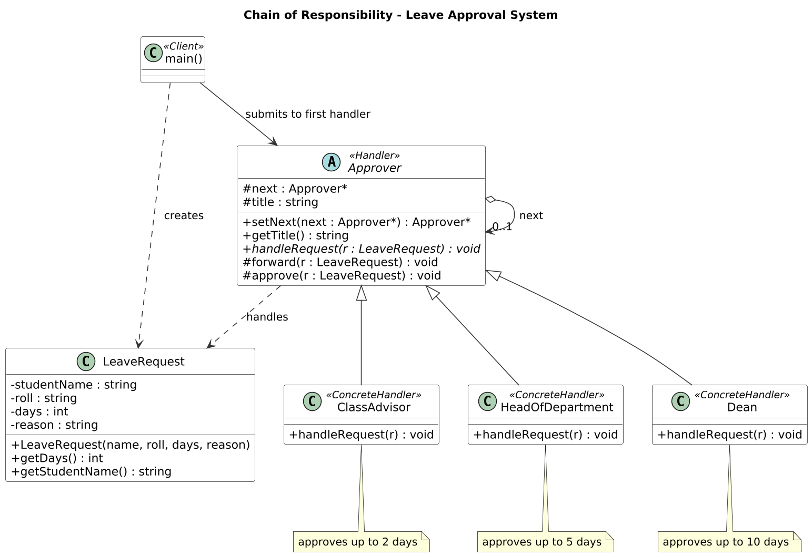

# SWE Lab Project 3 — Chain of Responsibility
**CSE 3206: Software Engineering Sessional · Lab 3 · Group 06**
Rajshahi University of Engineering & Technology (RUET), Department of CSE
Course teacher: Farjana Parvin, Assistant Professor

**Companion repository:** [SWE_Lab_Project_4 — Command Pattern](https://github.com/IbnSinan/SWE_Lab_Project_4)

## Scenario: University Leave Approval System
A student's leave request goes to the **Class Advisor** only. Each approver either approves it or passes it to the next one:

| Approver | Can approve |
|---|---|
| Class Advisor | up to 2 days |
| Head of Department | up to 5 days |
| Dean | up to 10 days |
| — | more than 10 days → rejected |

The student never needs to know who will finally approve the request, and new approvers can be added without changing existing classes (Open/Closed Principle).

## Class diagram


## Files and authors
| File | GoF role | Author |
|---|---|---|
| `LeaveRequest.h` | Request | Shahriar Ahmed Sohan (2203136) |
| `Approver.h` | Handler (abstract) | Shahriar Ahmed Sohan (2203136) |
| `ConcreteApprovers.h` | Concrete Handlers: `ClassAdvisor`, `HeadOfDepartment`, `Dean` | Md. Amanur Rahman Akash (2203138) |
| `main.cpp` | Client | Md. Ibn Sinan Mahdi (2203137) |

## Build and run
```bash
g++ -std=c++17 -Wall -o leave_approval main.cpp
./leave_approval          # on Windows: leave_approval.exe
```
Or use `make run`. The program runs four sample requests (1, 4, 8, 15 days), shows an invalid request, and then lets you enter your own number of days (0 to exit).

Sample output: [`docs/sample_output.txt`](docs/sample_output.txt) · Execution flow: [`diagrams/cor_sequence.png`](diagrams/cor_sequence.png)

## Group 06
| Roll | Name |
|---|---|
| 2203136 | Shahriar Ahmed Sohan |
| 2203137 | Md. Ibn Sinan Mahdi |
| 2203138 | Md. Amanur Rahman Akash |
